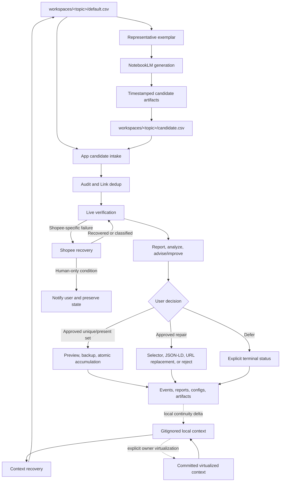

# Data Phin-ter Plugin Architecture

This document is the detailed reference behind the short
[plugin overview](overview.md). The overview is the discovery surface; this file owns deeper
responsibility, data-flow, and maintenance semantics.

Execution prerequisites and supported stop behavior live in
[runtime-prerequisites.md](runtime-prerequisites.md).

## Component Responsibilities

| Component | Responsible skill | Owns | Must not own |
|---|---|---|---|
| Context recovery | `read-effective-verbal-context` | Recover state, map workstreams, reconcile evidence and conflicts | Execute every optional branch or trust handoff over source |
| Candidate generation | `notebooklm-sst-research` | NotebookLM research, aggregation, strict completion, candidate artifacts | Verify prices, merge, dedup against default, or write default |
| Candidate intake | `app-sst-candidate-intake` | Audit, app import, Link dedup, verification, report gate, approved accumulation | Silently choose acceptance or add reporting dashboards |
| Shopee recovery | `shopee-scrape-recovery` | Classify Shopee failures, preserve intervention state, bounded hardening | Treat login/captcha/access blocks as selector failures |

Handoff writing is an owner-retained capability outside the plugin. Context recovery may create the
gitignored `effective-verbal-context.local.md` from the committed, virtualized
`effective-verbal-context.md`; that materialization is not public handoff authorship. Plugin
workflows must still identify architecture/documentation deltas so the owner can apply them without
hidden context.

## Runtime Data Flow

## Decision And Mutation Rules

1. NotebookLM candidate completion is independent of the accumulated default store.
2. Only a strict-complete generation run may replace the current-candidate pointer as completed.
3. Verification results are reported before the user chooses accumulation, repair, or deferral.
4. Default data changes only through the app-owned approved write path: preview, Link dedup, backup,
   atomic replace, event evidence, and idempotency.
5. Reporting remains an agent workflow responsibility. The app exposes operational controls and
   machine-readable state, not a cross-run report dashboard.
6. Human-only intervention conditions are reported promptly rather than hidden behind retries.

## Verification Modes

| Public mode | Backend | Policy |
|---|---|---|
| `compatible` | Selenium | Default for normal and agent-assisted verification |
| `fast` | Requests + BeautifulSoup | Explicit optimization for suitable static sources |
| `adaptive` | CloakBrowser and provider-specific recovery | Escalation after evidence, proposal, and user approval |

`?agent=1` is independent of this selection. Loading context makes the adaptive route discoverable;
it does not activate it. A mode change should identify the failing source class, expected benefit,
runtime/privacy impact, and whether the change is one run or a new default.

## Agent Controls And Information Parity

The app's **Load default data**, **Add candidate data**, and **Accumulate approved unique** controls
are automation affordances. Base markup keeps them hidden; `?agent=1` reveals them. They are not
normal-user controls and should not be mirrored into normal mode merely for visual symmetry.

Information parity means both parties know the same business facts through suitable channels:

| Fact | User channel | Agent channel |
|---|---|---|
| Verification outcome and available branches | Report and conversation | Report, verification API, artifacts |
| Accepted standard and write approval | Explicit decision | Recorded post-report decision in current verification state |
| Accumulation preview and result | Agent's visible report/update | Accumulation API, hidden DOM status, event log |
| Backup, before/after counts, terminal state | Completion report | API response, config, events |

The query flag is only a visibility control. When both the connection and hostname are loopback, the
automation header identifies the local agent workflow. Other requests are denied unless remote
automation is explicitly enabled and
the request provides a matching automation token. Commit additionally requires a matching run ID
and recorded post-report approval.

## Automation Boundary

The recurring automation invokes `notebooklm-sst-research` and preserves the stable automation ID
`daily-notebooklm-sst-data-run`. It may write `workspaces/<topic>/candidate.csv` only after strict
completion and may never write configured default data. App intake remains a separate user-directed
workflow.

Scheduling is a host adapter. Before a recurring run starts, the adapter must prove it can access the
intended signed-in browser context, route intervention, preserve state, and identify one run per
cadence window. A detached job that cannot request browser permission is not an eligible NotebookLM
execution host. Cadence changes update the existing automation identity; artifact names use actual
start time so daily, 12-hourly, and ad-hoc runs cannot overwrite each other.

## Cross-Agent Packaging

| Layer | Codex | Claude Code / Cowork |
|---|---|---|
| Manifest | `.codex-plugin/plugin.json` | `.claude-plugin/plugin.json` |
| Shared workflow | `skills/<name>/SKILL.md` | Same files |
| Browser adapter | Installed Codex browser capability | Claude for Chrome or another permitted browser capability |
| Local execution | Shell/filesystem tools available to the session | Claude Code/Cowork file and command capabilities granted for the selected folder |

Installing the plugin exposes workflow knowledge, not guaranteed runtime access. Skills must perform
capability preflight and must not silently replace a missing browser, scheduler, or local listener
with an unrelated transport.

## Semantic Link Maintenance

Architecture is a maintained workflow artifact. During **Report, analyze, and advise/improve**, any
accepted change must be classified against this matrix:

| Changed behavior | Required synchronized artifacts |
|---|---|
| Entry point or skill relationship | Repo README, `references/overview.md`, detailed architecture, local handoff; public context when explicitly virtualized |
| Skill responsibility or workflow order | Affected `SKILL.md`, detailed architecture, local handoff |
| Candidate/default/verification status contract | Skill, `artifact-and-status-contract.md`, local handoff |
| User decision gate or mutation rule | Intake skill, detailed architecture, tests, local handoff |
| New recovery/failure class | Recovery skill/references, detailed architecture when cross-component, local handoff |
| Plugin packaging/version | Both host manifests, plugin README, local handoff; public context when explicitly virtualized |
| Runtime capability or intervention point | Affected skill, runtime prerequisites, architecture when cross-component, local handoff |

Plugin workflows report the required documentation delta. The owner-held continuity process applies
it to the local handoff first. The committed context changes only through an explicit virtualization
step. A layer that cannot be synchronized is recorded as a blocker or residual risk, not silently
left stale.

For a stranger, “synchronize the handoff” therefore means describing the exact delta and its evidence
for the owner. It does not grant or imply access to `write-effective-verbal-context`.

## Source And Bundle Synchronization

Repository development copies under `.codex/skills/` are canonical authoring sources. The
host-neutral plugin bundle contains release snapshots under
`plugins/data-phinter-workflows/skills/`. Run `scripts/sync_skills.py` after skill changes and
`scripts/validate_bundle.py` before Stranger audit or release. Validation fails when canonical and
bundled skill trees differ, either host manifest is invalid, or the public/local context contract
regresses.

## External Quality Boundary

Stranger audit is not shown as a plugin node because it is external acceptance testing. Its fixed
entry condition is the repository README; the independent auditor then invokes
`read-effective-verbal-context` according to its own understanding, materializes its own local
context, and evaluates whether this plugin can be discovered and operated without hidden project or
machine history.
