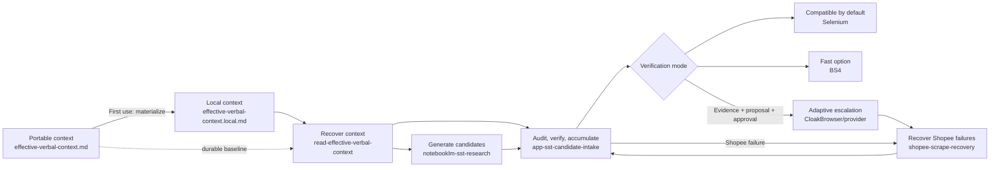

# Data Phin-ter Plugin Overview

Use this map after recovering project state with `read-effective-verbal-context`. It provides the
smallest complete set of entry points; follow the responsible skill when deeper mechanics are needed.

| Need | Entry skill | Next depth |
|---|---|---|
| Understand or resume the project | `read-effective-verbal-context` | Handoff, configs, then detailed architecture |
| Produce a new candidate artifact | `notebooklm-sst-research` | Generation boundary and output contract |
| Process an existing candidate | `app-sst-candidate-intake` | Audit, verification, report gate, approved write |
| Diagnose a Shopee-specific failure | `shopee-scrape-recovery` | Failure taxonomy and bounded recovery |

Verification starts in Selenium-backed `compatible`. A stranger can discover `fast` and `adaptive`
from this map without activating them accidentally. Context recovery may identify evidence for an
adaptive escalation, but the agent must explain and obtain user approval before switching.

The public context is committed and virtualized. `read-effective-verbal-context` creates or prefers
the gitignored local context for machine/run state. Handoff writing remains owner-maintained outside
the plugin: a stranger may materialize/read local context and report a documentation delta, but does
not publish it.

The skill graph is host-neutral. Codex, Claude Code, and Claude/Cowork use host-specific plugin/tool
adapters, then follow the same artifact, decision, and ownership contracts. Runtime capability does
not follow automatically from installing a skill.

Continue with [architecture.md](architecture.md) for component mechanics or
[artifact-and-status-contract.md](artifact-and-status-contract.md) for state and artifact semantics.
Before execution, read [runtime-prerequisites.md](runtime-prerequisites.md) for capability checks,
human-intervention points, and supported stop behavior.
