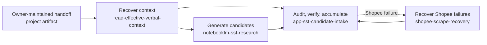

# Data Phin-ter Plugin Overview

Use this map after recovering project state with `read-effective-verbal-context`. It provides the
smallest complete set of entry points; follow the responsible skill when deeper mechanics are needed.

| Need | Entry skill | Next depth |
|---|---|---|
| Understand or resume the project | `read-effective-verbal-context` | Handoff, configs, then detailed architecture |
| Produce a new candidate artifact | `notebooklm-sst-research` | Generation boundary and output contract |
| Process an existing candidate | `app-sst-candidate-intake` | Audit, verification, report gate, approved write |
| Diagnose a Shopee-specific failure | `shopee-scrape-recovery` | Failure taxonomy and bounded recovery |

Handoff writing is owner-maintained outside the plugin. A stranger reads it through
`read-effective-verbal-context` and reports any required documentation delta.

Continue with [architecture.md](architecture.md) for component mechanics or
[artifact-and-status-contract.md](artifact-and-status-contract.md) for state and artifact semantics.
Before execution, read [runtime-prerequisites.md](runtime-prerequisites.md) for capability checks,
human-intervention points, and supported stop behavior.
